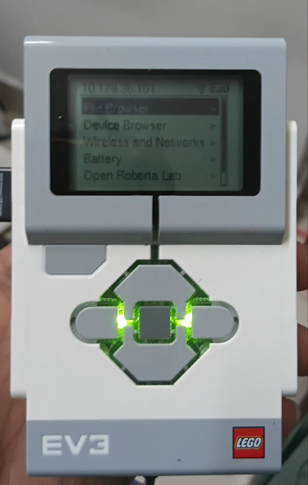
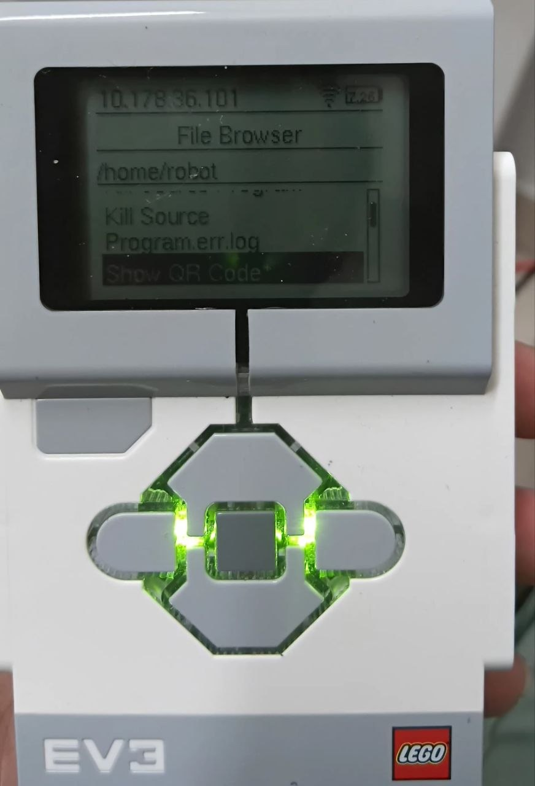
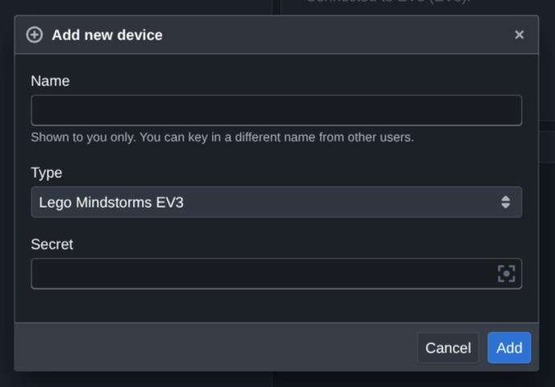
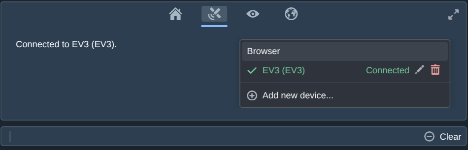
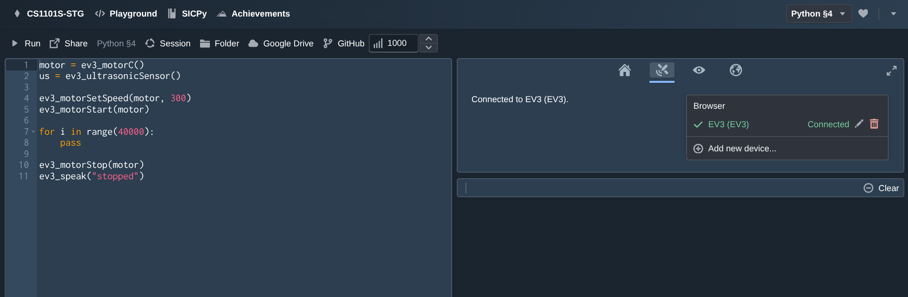

# EV3-Source Setup Guide (Python)

Welcome to the world of LEGO Mindstorms EV3! This guide covers flashing the SD card, connecting your robot, and running Python on it.

> This is the **Python** version of the setup guide. Looking for Source (JavaScript)? See [the original guide](https://source-academy.github.io/ev3-source/).

**Quick links:** [Latest EV3-Source image][latest-img] · [Jump to troubleshooting](#troubleshooting)

**Steps:**

1. [Flashing the SD card](#1-flashing-the-sd-card)
2. [Booting and connecting to WiFi](#2-booting-and-connecting-to-wifi)
3. [Getting your device's pairing secret](#3-getting-your-devices-pairing-secret)
4. [Pairing the device on Source Academy](#4-pairing-the-device-on-source-academy)
5. [Writing and running Python](#5-writing-and-running-python)
6. [Examples](#6-examples)

---

## 1. Flashing the SD card

Download the [Source Academy's customised ev3dev image from here][latest-img]. Then, use an image burner of your choice to install the image onto the microSD card issued. You will require a microSD card reader for this.

We recommend [balenaEtcher](https://etcher.balena.io/) — it works cross-platform and handles the "unreadable card" warning your OS may show gracefully (that warning is normal; dismiss it and let Etcher flash the card anyway).

## 2. Booting and connecting to WiFi

Insert the flashed card and power on the EV3. It should boot to a home screen showing the battery voltage at the top-right. A fully charged battery reads around 8.3V; below 6V, expect it to run flat soon.

Connect it to WiFi from the brickman menu: **Wireless and Networks → your network**. Any network with internet access works — **the EV3 does not need to be on the same network as your computer.** Pairing and running code both go through Source Academy's own server as a relay, not a direct connection between your browser and the robot, so your laptop and the EV3 can be on completely different networks (say, your laptop on campus WiFi and the EV3 tethered to your phone) and everything still works.



## 3. Getting your device's pairing secret

Every EV3 has a unique secret that identifies it to the Source Academy backend. Get it one of two ways:

- **On the EV3's screen** (recommended — works no matter what network the EV3 is on) — open the **Show QR Code** app from the brickman menu (File Browser → `/home/robot` → **Show QR Code**, pictured below). It displays a QR code and the secret as text underneath.
- **Over the network** — if your computer happens to be on the *same* network as the EV3, you can instead visit `http://ev3dev.local/cgi-bin/qr.cgi` in a browser (or `index.cgi` for the secret as plain text). This one specifically needs your computer to reach the EV3 directly, unlike everything else in this guide.



Keep this secret handy for the next step — you'll only need to do this once per robot.

## 4. Pairing the device on Source Academy

1. Log into [Source Academy](https://sourceacademy.nus.edu.sg) (or your course's deployment) and open the Playground.
2. Open the **Remote Execution** panel (the satellite icon among the side content tabs).
3. Click **Add new device...**, paste in the secret from step 3, give it a name, and select device type **EV3**.



Once paired, the device appears in the panel. It may take a few seconds to show as **Connected** — that's your robot's persistent connection actually coming online, not a page-refresh issue.



You only need to pair a device once — it stays paired to your account. Next time, just power on the robot and select it from the same panel.

## 5. Writing and running Python

Unlike older EV3-Source workflows, **you don't need to SSH in or manually transfer files to run a program.** Select **Python** as your language (top-right chapter selector), select your paired EV3 as the active device, write your code directly in the editor, and hit **Run**. Your code is compiled in the browser and shipped to the robot automatically.



SSH access to the robot still exists (**Enable SSH** / **Reset SSH Password** in the on-device **Source Academy Settings** app) but is only needed for advanced debugging — you will not need it for normal coursework, and it's the *only* thing in this guide that requires your computer and the EV3 to be on the same network (since it's a direct connection, unlike pairing/running code, which both go through Source Academy's server).

> **⚠️ If you do need SSH and you're using a phone as a WiFi hotspot:** check that "AP isolation" / "Client isolation" is turned off in the hotspot's settings. Many phones enable this by default, which blocks devices on the same hotspot from reaching each other directly — including your laptop reaching the EV3 over SSH — even though both show as "connected" to the same network. There's no error message for this; SSH just times out, which is confusing without knowing to look here. This has no effect on pairing or running code.

> **⚠️ Known limitation — `print()` produces no output.** `print()` statements in code running on the physical EV3 currently do not appear anywhere in the browser. This is a known gap in the underlying interpreter, not something wrong with your code or setup. Until it's fixed, use `ev3_speak(str(value))` instead — it will say the value out loud:
>
> ```python
> us = ev3_ultrasonicSensor()
> distance = ev3_ultrasonicSensorDistance(us)
> ev3_speak(str(distance))
> ```

## 6. Examples

### Motor + sensor: drive until close to an obstacle

```python
motor = ev3_motorC()
us = ev3_ultrasonicSensor()

ev3_motorSetSpeed(motor, 300)
ev3_motorStart(motor)

while True:
    distance = ev3_ultrasonicSensorDistance(us)
    ev3_speak(str(distance))
    if distance < 20:
        break
    ev3_pause(500)

ev3_motorStop(motor)
ev3_speak("stopped")
```

### A simple line follower

Mount a light/colour sensor near one edge of a black line on a white floor, with drive motors on ports A and B:

```python
BASE_SPEED = 200
KP = 4          # steering aggressiveness - tune this
TARGET = 50     # reflected-light value at the line's edge - tune to your floor/line contrast

left = ev3_motorA()
right = ev3_motorB()
sensor = ev3_colorSensor()

ev3_motorStart(left)
ev3_motorStart(right)

while True:
    light = ev3_reflectedLightIntensity(sensor)
    error = light - TARGET
    turn = KP * error

    ev3_motorSetSpeed(left, BASE_SPEED + turn)
    ev3_motorSetSpeed(right, BASE_SPEED - turn)

    ev3_pause(10)
```

> **Note on timing:** `ev3_motorStart`/`ev3_motorStop` are both non-blocking — they just tell the motor to start or stop and return immediately. A program that calls `ev3_motorStart` immediately followed by `ev3_motorStop`, with nothing in between, will not visibly move the motor at all: on-device code runs as fast as the interpreter can execute it, so "stop" arrives before the motor has had any real time to move. Use `ev3_pause(ms)`, or a loop with real work in it like the examples above, to give the motor actual wall-clock time to move.

## Python EV3 function reference

The full set of `ev3_*` functions works identically to [the Source-language EV3 library](https://source-academy.github.io/ev3-source/jsdoc/) — every function has the same name, same arguments, same behaviour. If you already know the Source EV3 API, or are looking at its reference docs, you already know Python's.

## Troubleshooting

| Symptom | Likely cause |
|---|---|
| The EV3 doesn't show up when pairing, even though it's connected to WiFi | This shouldn't be a network-connectivity issue — pairing goes through Source Academy's server, not a direct connection. Double check the secret was copied correctly, and that the EV3's WiFi actually has internet access (not just a local network with no internet) |
| I can't reach the EV3 over SSH, even though it's on the same hotspot as my computer | AP isolation on your hotspot — see the note in [step 5](#5-writing-and-running-python) |
| `print()` shows nothing | Expected right now — see the note in [step 5](#5-writing-and-running-python), use `ev3_speak()` instead |
| The robot moved for a split second and then stopped, even though nothing told it to stop | You likely need `ev3_pause()` between start and stop — see the [timing note](#a-simple-line-follower) under Examples |

## Appendix: alternative flashing instructions

See [the main guide's appendix](https://source-academy.github.io/ev3-source/#appendix-alternative-flashing-instructions) — the flashing process itself is identical regardless of language.

[latest-img]: https://github.com/source-academy/ev3-source/releases/latest/download/ev3-source.img.zip
